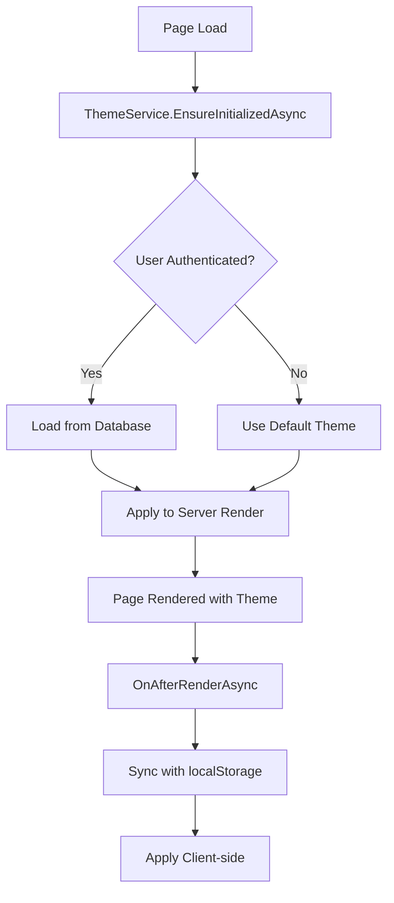

# Theme Service Documentation

The ThemeService provides server-side theme management with database persistence and localStorage backup for Blazor Server applications. It supports multiple professional color schemes and dark mode with zero theme flash during page loads.

## Architecture Overview

The theme system uses a server-side first approach where themes are applied during initial server rendering, preventing the common "theme flash" problem in client-side applications.

### Key Components

- **ThemeService**: Core service managing theme state and persistence
- **ThemeSwitcher**: Blazor component for theme selection UI
- **CSS Variables**: Theme definitions using CSS custom properties
- **JavaScript Interop**: Client-side theme application for dynamic updates
- **Database Storage**: User theme preferences stored in ApplicationUser entity
- **localStorage Backup**: Fallback storage for anonymous users

## Theme System Flow



## Available Themes

The service supports 14 professional color schemes:

```csharp
// Available themes with their primary colors
new("default", "Professional Neutral", "#475569"),
new("financial-blue", "Corporate Finance", "#1a365d"),
new("tech-slate", "Modern Tech", "#475569"),
new("medical-teal", "Healthcare Professional", "#0d9488"),
new("executive-charcoal", "Executive Consulting", "#374151"),
new("executive-purple", "Executive Purple", "#782789"),
new("sunset-rose", "Sunset Rose", "#ec4899"),
new("trust-blue", "Trust Blue", "#1e40af"),
new("growth-green", "Growth Green", "#16a34a"),
new("innovation-orange", "Innovation Orange", "#ea580c"),
new("midnight-teal", "Midnight Teal", "#0f766e"),
new("heritage-burgundy", "Heritage Burgundy", "#be123c"),
new("platinum-gray", "Platinum Gray", "#374151"),
new("deep-navy", "Deep Navy", "#1e3a8a")
```

Each theme includes:
- Primary and secondary colors
- Light and dark background variants
- Success, warning, and danger colors
- Info color for UI elements

## Server-Side Theme Rendering

### Theme Class Generation

The `GetThemeClassForRendering()` method generates CSS classes for server-side rendering:

```csharp
public string GetThemeClassForRendering()
{
    var classes = new List<string>();
    
    // Add theme class if not default
    if (!string.IsNullOrEmpty(_currentTheme) && _currentTheme != "default")
    {
        if (_themeClassMap.TryGetValue(_currentTheme, out var themeClass) && !string.IsNullOrEmpty(themeClass))
        {
            // Validate CSS class name to prevent XSS
            if (IsValidCssClassName(themeClass))
            {
                classes.Add(themeClass);
            }
        }
    }
    
    // Add dark mode class if enabled
    if (_isDarkMode)
    {
        classes.Add("dark-mode");
    }
    
    return string.Join(" ", classes);
}
```

### Application in App.razor

The theme classes are applied to the document root during server rendering:

```csharp
protected override async Task OnInitializedAsync()
{
    // Initialize theme service and get server-side theme classes
    await ThemeService.EnsureInitializedAsync();
    ThemeClasses = GetThemeClasses();
}

private string GetThemeClasses()
{
    // Use the ThemeService's method to get proper theme classes
    var themeClasses = ThemeService.GetThemeClassForRendering();
    if (!string.IsNullOrEmpty(themeClasses))
    {
        classes.Add(themeClasses);
    }
    
    return string.Join(" ", classes);
}
```

## Database Storage Strategy

### User Entity Extension

Theme preferences are stored in the ApplicationUser entity:

```csharp
public class ApplicationUser : IdentityUser
{
    public string? ThemePreference { get; set; }
}
```

### Serialization Format

Theme preferences are serialized as pipe-delimited strings:

```csharp
private string SerializeThemePreference(string theme, bool isDarkMode)
{
    return $"{theme}|{isDarkMode}";
}
```

Example: `"trust-blue|true"` represents Trust Blue theme with dark mode enabled.

### Loading User Preferences

```csharp
private async Task LoadUserThemeAsync(string themePreference)
{
    var parts = themePreference.Split('|');
    if (parts.Length >= 1)
    {
        _currentTheme = parts[0];
    }
    if (parts.Length >= 2 && bool.TryParse(parts[1], out var darkMode))
    {
        _isDarkMode = darkMode;
    }
}
```

## localStorage Backup Strategy

For anonymous users and as a fallback mechanism:

```csharp
private async Task SyncWithLocalStorageAsync()
{
    var savedTheme = await _jsRuntime.InvokeAsync<string>("localStorage.getItem", "app-theme");
    var savedDarkMode = await _jsRuntime.InvokeAsync<string>("localStorage.getItem", "app-dark-mode");
    
    // Only update from localStorage if we don't have user preferences from database
    if (!hasUserPreference)
    {
        _currentTheme = !string.IsNullOrEmpty(savedTheme) ? savedTheme : "default";
        
        if (bool.TryParse(savedDarkMode, out var darkMode))
        {
            _isDarkMode = darkMode;
        }
    }
    else
    {
        // Ensure localStorage matches database preference
        await _jsRuntime.InvokeVoidAsync("localStorage.setItem", "app-theme", _currentTheme);
        await _jsRuntime.InvokeVoidAsync("localStorage.setItem", "app-dark-mode", _isDarkMode.ToString());
    }
}
```

## JavaScript Interop Patterns

### Theme Manager

The client-side theme manager handles dynamic theme switching:

```javascript
window.themeManager = {
    themeClasses: [
        'executive-purple', 'sunset-rose', 'trust-blue', 'growth-green',
        'innovation-orange', 'midnight-teal', 'heritage-burgundy', 
        'platinum-gray', 'deep-navy', 'financial-blue', 'tech-slate',
        'medical-teal', 'executive-charcoal', 'dark-mode'
    ],
    
    setRootTheme: (themeClass) => {
        const root = document.documentElement;
        
        // Remove all existing theme classes
        window.themeManager.themeClasses.forEach(cls => root.classList.remove(cls));
        
        // Apply new theme classes if provided
        if (themeClass && themeClass.trim()) {
            const classes = themeClass.trim().split(' ');
            classes.forEach(cls => {
                if (cls.trim() && window.themeManager.themeClasses.includes(cls.trim())) {
                    root.classList.add(cls.trim());
                }
            });
        }
    }
};
```

### Blazor Server JavaScript Interop Rules

**CRITICAL**: JavaScript interop calls cannot be made during server-side prerendering. The ThemeService follows this pattern:

```csharp
public async Task InitializeAsync(bool afterRender = false)
{
    if (!afterRender)
    {
        // During prerendering, load from server-side sources only
        await EnsureInitializedAsync();
        return;
    }

    // After render, sync with localStorage and apply theme
    await SyncWithLocalStorageAsync();
    await ApplyThemeAsync();
    OnThemeChanged?.Invoke();
}
```

Components must call this correctly:

```csharp
protected override async Task OnAfterRenderAsync(bool firstRender)
{
    if (firstRender)
    {
        await ThemeService.InitializeAsync(afterRender: true);
    }
}
```

## Theme Switching Mechanism

### Setting Theme

```csharp
public async Task SetThemeAsync(string theme)
{
    // Validate theme exists
    if (!_themeClassMap.ContainsKey(theme))
    {
        _logger.LogWarning("Attempted to set invalid theme: {Theme}", theme);
        return;
    }
    
    _currentTheme = theme;
    
    // Save to database for authenticated users
    var authState = await _authStateProvider.GetAuthenticationStateAsync();
    if (authState.User.Identity?.IsAuthenticated == true)
    {
        var user = await _userManager.GetUserAsync(authState.User);
        if (user != null)
        {
            var themePreference = SerializeThemePreference(_currentTheme, _isDarkMode);
            user.ThemePreference = themePreference;
            await _userManager.UpdateAsync(user);
        }
    }

    // Save to localStorage as backup
    await _jsRuntime.InvokeVoidAsync("localStorage.setItem", "app-theme", theme);
    
    // Refresh page to apply server-side theme
    _navigationManager.Refresh();
}
```

### Dark Mode Toggle

```csharp
public async Task ToggleDarkModeAsync()
{
    _isDarkMode = !_isDarkMode;
    
    // Save to database and localStorage
    // ... (similar to SetThemeAsync)
    
    // Refresh page to apply server-side theme
    _navigationManager.Refresh();
}
```

## CSS Variables System

Themes are implemented using CSS custom properties that cascade throughout the application:

```css
:root {
    /* Default theme variables */
    --color-light: #f8fafc;
    --color-dark: #1e293b;
    --color-primary: #475569;
    --color-secondary: #64748b;
    --color-info: #e2e8f0;
    --color-success: #10a669;
    --color-warning: #dcce0f;
    --color-danger: #ea3106;
}

/* Theme-specific overrides */
:root.trust-blue {
    --color-light: #f8fafc;
    --color-dark: #0f172a;
    --color-primary: #1e40af;
    --color-secondary: #3b82f6;
    --color-info: #dbeafe;
}

/* Dark mode overrides */
:root.dark-mode {
    --color-light: #1e293b;
    --color-dark: #f1f5f9;
    --color-primary: #94a3b8;
}
```

## ThemeSwitcher Component

The UI component for theme selection:

```razor
@rendermode InteractiveServer
@using BlazorTemplate.Services
@inject ThemeService ThemeService

<div class="theme-switcher">
    <div class="dropdown">
        <button class="btn btn-outline-secondary dropdown-toggle" 
                type="button" 
                data-bs-toggle="dropdown">
            <i class="fas fa-palette me-1"></i>Theme
        </button>
        <ul class="dropdown-menu dropdown-menu-end">
            @foreach (var theme in availableThemes)
            {
                <li>
                    <button class="dropdown-item @(ThemeService.CurrentTheme == theme.Value ? "active" : "")" 
                            @onclick="() => SetTheme(theme.Value)">
                        @theme.Name
                    </button>
                </li>
            }
            <li><hr class="dropdown-divider"></li>
            <li>
                <button class="dropdown-item @(ThemeService.IsDarkMode ? "active" : "")" 
                        @onclick="ToggleDarkMode">
                    Dark Mode
                </button>
            </li>
        </ul>
    </div>
</div>

@code {
    private List<ThemeOption> availableThemes = new();

    protected override async Task OnInitializedAsync()
    {
        availableThemes = ThemeService.GetAvailableThemes();
        ThemeService.OnThemeChanged += StateHasChanged;
    }

    protected override async Task OnAfterRenderAsync(bool firstRender)
    {
        if (firstRender)
        {
            await ThemeService.InitializeAsync(afterRender: true);
        }
    }

    private async Task SetTheme(string theme)
    {
        await ThemeService.SetThemeAsync(theme);
    }

    private async Task ToggleDarkMode()
    {
        await ThemeService.ToggleDarkModeAsync();
    }

    public void Dispose()
    {
        ThemeService.OnThemeChanged -= StateHasChanged;
    }
}
```

## Security Considerations

### CSS Class Validation

The service validates CSS class names to prevent XSS attacks:

```csharp
private static readonly Regex _validCssClassRegex = new(@"^[a-zA-Z_][\w\-]*$", RegexOptions.Compiled);

private bool IsValidCssClassName(string className)
{
    if (string.IsNullOrEmpty(className))
        return false;
        
    return _validCssClassRegex.IsMatch(className);
}
```

### Theme Mapping

Themes are mapped to predefined CSS classes to prevent injection:

```csharp
private Dictionary<string, string> InitializeThemeMapping()
{
    return new Dictionary<string, string>
    {
        { "default", "" },
        { "executive-purple", "executive-purple" },
        // ... other themes
    };
}
```

## Thread Safety

The service uses semaphores for thread-safe operations:

```csharp
private readonly SemaphoreSlim _initSemaphore = new(1, 1);
private readonly SemaphoreSlim _stateLock = new(1, 1);

public async Task SetThemeAsync(string theme)
{
    await _stateLock.WaitAsync();
    try
    {
        _currentTheme = theme;
    }
    finally
    {
        _stateLock.Release();
    }
}
```

## Page Refresh Strategy

The service uses page refresh for theme changes to ensure consistent server-side rendering:

```csharp
// Refresh the page to apply server-side theme
_navigationManager.Refresh();
```

This approach:
- Ensures theme is applied during server rendering
- Prevents theme flash on subsequent page loads
- Maintains theme consistency across all page elements
- Works reliably with Blazor Server's rendering model

## Configuration Options

No additional configuration is required. The service uses dependency injection and automatically:
- Registers with the DI container
- Loads user preferences from database
- Falls back to localStorage for anonymous users
- Applies default theme when no preference exists

## Integration with Components

Components can access theme information through dependency injection:

```csharp
@inject ThemeService ThemeService

@code {
    protected override async Task OnInitializedAsync()
    {
        // Subscribe to theme changes
        ThemeService.OnThemeChanged += StateHasChanged;
        
        // Get current theme info
        var currentTheme = ThemeService.CurrentTheme;
        var isDarkMode = ThemeService.IsDarkMode;
    }
}
```

## Extending the Theme System

### Adding New Themes

1. Add theme to `InitializeThemeMapping()` in ThemeService
2. Add CSS variables in `color-schemes.css`
3. Add theme class to JavaScript `themeClasses` array
4. Update `GetAvailableThemes()` method

### Custom Theme Properties

Extend themes by adding new CSS variables:

```css
:root.custom-theme {
    --color-primary: #your-color;
    --custom-property: #your-value;
    /* Add component-specific variables */
    --button-radius: 8px;
    --card-shadow: 0 4px 6px rgba(0, 0, 0, 0.1);
}
```

## Troubleshooting

### Theme Not Applying

1. Check browser console for JavaScript errors
2. Verify theme exists in `_themeClassMap`
3. Ensure CSS is loaded correctly
4. Check that component has `@rendermode InteractiveServer`

### Database Errors

1. Verify ApplicationUser has ThemePreference property
2. Check Entity Framework migrations are applied
3. Ensure user is authenticated for database storage

### localStorage Issues

1. Check browser security settings
2. Verify JavaScript is enabled
3. Test in private/incognito mode to rule out storage quota issues

This theme system provides a robust, secure, and user-friendly theming solution for Blazor Server applications with zero flash and reliable persistence across user sessions.